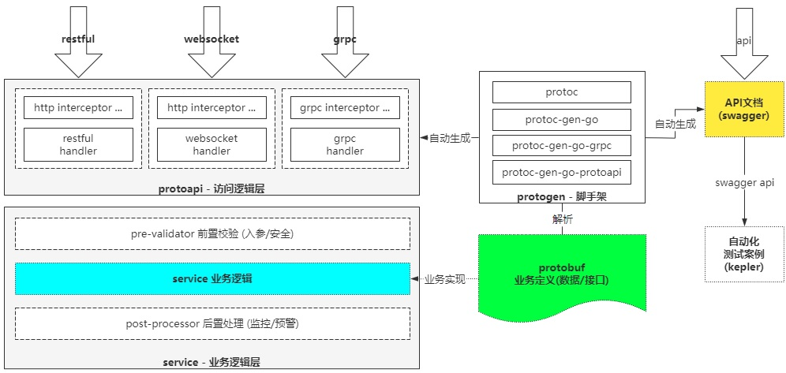
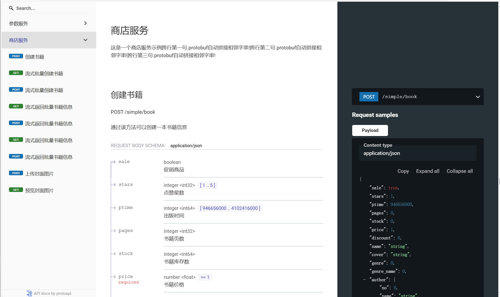

# protoapi使用指南

protoapi基于protobuf快捷开发微服务API.



## 一. 开发环境

### 1.1 安装go

**版本要求: go1.21+**

- 官方下载: https://golang.google.cn/

### 1.2 安装git

**版本要求: git2.0.0+**

- 官方下载: https://git-scm.com/

注意: 私有仓库需要授权认证(双因子认证), 因为go get或go install无法使用https协议, 所以需在git底层替换为ssh协议.

### 1.3 安装protogen

protogen工具封装了protoc及插件的复杂性, 自动下载安装所需插件, 一键生成protobuf代码与swagger文档.

- windows环境

```
set GOBIN=<PATH目录>
go install github.com/hezof/protoapi/cmd/protogen@latest && protogen -update 
```

- linux与darwin环境

```
env \
GOBIN=<PATH目录> \
go install github.com/hezof/protoapi/cmd/protogen@latest && protogen -update
```

建议: 安装protogen后更新plugins!

### 1.4 安装protodoc

protodoc是swagger文档的http服务器, 方便发布或浏览protobuf的swagger文档.

```
set GOBIN=<PATH目录>
go install github.com/hezof/protoapi/cmd/protodoc@latest
```

- linux与darwin环境

```
env \
GOBIN=<PATH目录> \
go install github.com/hezof/protoapi/cmd/protodoc@latest
```

## 二. 开发流程

基于protobuf快捷开发微服务API, 只需简单的4步:

1. 定义服务API(数据结构与服务接口)
2. 生成服务接口(*.pb.go, *_grpc.pb.go, *_protoapi.pb.go, *_protoapi.code, *_protoapi.yaml)
3. 实现服务逻辑
4. 注册服务实现

在"定义服务API(数据结构与服务接口)"后, 各类开发资源(前端/后端/测试...)以为proto为核心并行开发, 节省细节沟通成本,
提高开发测试效率.

### 2.1 定义服务API(数据结构与服务接口)

```
syntax = "proto3";
package api;
option go_package = ".;api";

import "github.com/hezof/protoapi.proto";

service Store {

  option (protoapi.info) = {
    name: "商店服务",
    desc: "这是一个商店服务示例"
        "跨行第一句.protobuf自动拼接相邻字串!"
        "跨行第二句.protobuf自动拼接相邻字串!"
        "跨行第三句.protobuf自动拼接相邻字串!"
  };
  option (protoapi.http_only) = false;

  rpc Simple (Book) returns(Book) {
    option (protoapi.role) = {
      code: 10001,
      name: "admin",
      desc: "超级管理员"
    };
    option (protoapi.http) = {
      name: "创建书籍",
      desc: "通过该方法可以创建一本书籍信息",
      post: "/simple/book",
      body: json,
      status: 200,
      result: normal,
      errors: [
        {
          code: 20001,
          status: 403,
          message: "书籍已存在"
        },
        {
          code: 20002,
          status: 502,
          message: "服务端错误"
        }
      ]
    };
  };

  rpc Client (stream Book) returns(Book) {
    option (protoapi.http) = {
      name: "流式批量创建书籍",
      desc: "通过该方法可以流式批量创建多本书籍信息",
      websocket: "/client/book",
      post: "/client/book",
      body: json,
      status: 200,
      result: unwrap
    };
  };

  rpc Server (Book) returns(stream Book) {
    option (protoapi.http) = {
      name: "流式返回批量书籍信息",
      desc: "通过该方法可以流式返回指书籍信息",
      websocket: "/server/book",
      post: "/server/book",
      body: json,
      status: 200,
      result: unwrap
    };
  };

  rpc UploadCovert(Book) returns(Book) {
    option (protoapi.http) = {
      name: "上传封面图片",
      desc: "通过该方法上传封面图片",
      post: "/covert/upload",
      body: form,
      status: 201,
      result: normal
    };
  };

  rpc ReviewCovert(Book) returns(Book) {
    option (protoapi.http) = {
      name: "预览封面图片",
      desc: "通过该方法预览封面图片",
      get: "/review/covert",
      body: omit,
      status: 202,
      result: normal
    };
  };
}


message Book {

  option (protoapi.schema) = "书籍信息";
  option (protoapi.extend) = "message(Book)"; // 扩展表达式

  bool sale = 1 [
    (protoapi.in) = body,
    (protoapi.desc) = "促销商品",
    (protoapi.zero) = with_empty,
    (protoapi.plugin) = {
      val: "check_sale(book)",
      err: {
        code: 100010,
        status: 403,
        message: "促销参数错误!",
      },
    }
  ];
  int32 stars = 2 [
    (protoapi.in) = body,
    (protoapi.desc) = "点赞星数",
    (protoapi.zero) = omit_empty,
    (protoapi.minimum) = {
      val: 1,
      err: {
        code: 100011,
        status: 403,
        message: "点赞星数错误!",
      },
    },
    (protoapi.maximum) = {
      val: 5,
      err: {
        code:100012,
        status: 403,
        message: "点赞星数错误!",
      },
    }
  ];
  int64 publication = 3 [
    (protoapi.name) = "ptime",
    (protoapi.desc) = "出版时间",
    (protoapi.zero) = omit_empty,
    (protoapi.minimum) = {
      val: 946656000, // 不能小于2000-01-01
      err: {
        code: 100013,
        status: 403,
        message: "出版时间错误!"
      }
    },
    (protoapi.maximum) = {
      val: 4102416000, // 不能大于2100-01-01
      err: {
        code: 100014,
        status: 403,
        message: "出版时间错误!"
      }
    }
  ];
  uint32 pages = 4 [
    (protoapi.desc) = "书籍页数"
  ];
  uint64 stock = 5 [
    (protoapi.desc) = "书籍库存数"
  ];
  float price = 6 [
    (protoapi.desc) = "书籍价格",
    (protoapi.zero) = with_empty,
    (protoapi.required) = {
      code: 100016,
      status: 403,
      message: "书籍价格错误",
    },
    (protoapi.minimum) = {
      val: 1,
      err: {
        code: 100017,
        status: 403,
        message: "书籍价格错误",
      }
    }
  ];
  double discount = 7 [
    (protoapi.desc) = "书籍折扣"
  ];
  string name = 8 [
    (protoapi.desc) = "书籍名称",
    (protoapi.required) = {
      code: 100018,
      status: 403,
      message: "书籍名称错误",
    }
  ];
  bytes cover = 9 [
    (protoapi.desc) = "封面数据",
    (protoapi.min_length) = {
      val: 1,
      err: {
        code: 100014,
        status: 403,
        message: "封面数据最小1b",
      }
    },
    (protoapi.max_length) = {
      val: 10240,
      err: {
        code: 100015,
        status: 403,
        message: "封面数据最大10Kb"
      }
    }
  ];
  Genre genre = 10 [
    (protoapi.desc) = "书籍类别(枚举数值)"
  ];
  Genre genre_name = 11 [
    (protoapi.desc) = "书籍类别(枚举名称)"
  ];
  Author author = 12 [
    (protoapi.desc) = "书籍作者信息",
    (protoapi.zero) = conv_empty
  ];
  string isbn = 13 [
    (protoapi.desc) = "书籍惟一编号"
  ];
}

enum Genre {
  UNKNOWN = 0;
  EDUCATION = 1; // 教育
  MAGAZINE = 2; // 杂志
  TEXTBOOK = 3; // 教科书
}

message Author {
  uint64 no = 1 [
    (protoapi.desc) = "作者编号"
  ];
  string name = 2 [
    (protoapi.desc) = "作者名称"
  ];
  string email = 3 [
    (protoapi.desc) = "作者邮箱"
  ];
}

```

### 2.2 生成服务接口(*.pb.go, *_grpc.pb.go, *_protoapi.pb.go, *_protoapi.code, *_protoapi.yaml)

```
cd demo/api
protogen .
```

#### 2.2.1 protogen为每个proto文件生成5类文件:

1. *.pg.go: protoc-gen-go插件生成的message或enum数据结构.
2. *_grpc.pb.go: protoc-gen-go-grpc插件生成的service的组件: Server/Client interface, Skeletons, Stubs...
3. *_protoapi.pb.go: protoc-gen-go-protoapi插件生成的扩展options的组件: ProtoJson, MessageValidator, ServiceRegistry....
4. *_protoapi.code: protoc-gen-go-protoapi插件生成的Service空实现, 开发者可以直接复制, 从而大大节省代码工作量.
5. *_protoapi.yaml: protoc-gen-go-protoapi插件生成的Swagger API. 使用protodoc可将Swagger API发布为API文档,
   或者导入kepler生成自动化测试用例.

#### 2.2.2 protogen详细用法

```
protogen -h

Build: v1.0.0
  protoc                 v3.21.12
  protoc-gen-go          v1.36.5
  protoc-gen-go-grpc     v1.5.1
  include                v1.0.0
  protoc-gen-go-protoapi v1.0.0-beta

Usage: protogen [options] <rel_dir|rel_file> [...]
  -clean
        清理文件[*.pb.go, *_grpc.pb.go, *_protoapi.pb.go, *_protoapi.yaml]
  -config string
        配置变量.默认"VERSION=v1.0.0;GOPROXY=https://goproxy.cn;GOPRIVATE=*.net,*.cn;MAVEN_CENTRAL=https://maven.aliyun.com/repository/central"
  -debug
        打印调试
  -go_out string
        GO输出目录,默认--proto_base
  -grpc_v2
        生成GRPC代码[require_unimplemented_servers=true]
  -h    打印帮助
  -help
        打印帮助
  -import string
        protoapi引入路径
  -proto_base string
        PB基准目录,默认当前目录
  -proto_path string
        PB查找目录[逗号分隔]
  -update
        更新插件
```

### 2.3 实现服务逻辑

```
package biz

import (
	"context"
	"google.golang.org/grpc"
	"github.com/hezof/protoapi/demo/api"
)

// StoreImplement api.Store. 这是一个商店服务示例跨行第一句.protobuf自动拼接相邻字串!跨行第二句.protobuf自动拼接相邻字串!跨行第三句.protobuf自动拼接相邻字串!
type StoreImplement struct{}

var _ api.StoreServer = (*StoreImplement)(nil)

// Simple api.Store.Simple. 通过该方法可以创建一本书籍信息
// POST /simple/book
func (ps *StoreImplement) Simple(ctx context.Context, req *api.Book) (rsp *api.Book, err error) {
	return
}

// Client api.Store.Client. 通过该方法可以流式批量创建多本书籍信息
// POST /client/book
// WEBSOCKET /client/book
func (ps *StoreImplement) Client(svr grpc.ClientStreamingServer[api.Book, api.Book]) (err error) {
	return
}

// Server api.Store.Server. 通过该方法可以流式返回指书籍信息
// POST /server/book
// WEBSOCKET /server/book
func (ps *StoreImplement) Server(req *api.Book, svr grpc.ServerStreamingServer[api.Book]) (err error) {
	return
}

// UploadCovert api.Store.UploadCovert. 通过该方法上传封面图片
// POST /covert/upload
func (ps *StoreImplement) UploadCovert(ctx context.Context, req *api.Book) (rsp *api.Book, err error) {
	return
}

// ReviewCovert api.Store.ReviewCovert. 通过该方法预览封面图片
// GET /review/covert
func (ps *StoreImplement) ReviewCovert(ctx context.Context, req *api.Book) (rsp *api.Book, err error) {
	return
}

```

注意: 在*_protoapi.code为每个Service生成了一个空实现, 开发者可以直接复制, 从而大大节省代码工作量.

### 2.4 注册服务实现

```
package main

import (
	"github.com/hezof/protoapi"
	test2 "github.com/hezof/protoapi/doc/api"
	"github.com/hezof/protoapi/doc/biz"
)

func main() {
	svr := protoapi.NewServer(&protoapi.Config{
		HttpAddr: ":8080",
		GrpcAddr: ":9090",
	})
	svr.RegisterService(api.StoreRegistry, new(biz.StoreImplement))

	if err := svr.ListenAndServe(); err != nil {
		panic(err)
	}
}
```

注意: 在*_protoapi.pb.go为每个Service生成了ServiceRegistry, 用于快速注册服务实现.

## 三. 基础API

### 3.1 Martini-Like API

- Group(path string, hs ...HandleFunc)
- Use(filters ...HandleFunc)
- Handle(hd *Handler)
- HandleFunc(method string, path string, hs ...HandleFunc)
- Any(path string, f ...HandleFunc)
- GET(path string, f ...HandleFunc)
- POST(path string, f ...HandleFunc)
- PUT(path string, f ...HandleFunc)
- DELETE(path string, f ...HandleFunc)
- HEAD(path string, f ...HandleFunc)
- PATCH(path string, f ...HandleFunc)
- OPTIONS(path string, f ...HandleFunc)
- CONNECT(path string, f ...HandleFunc)
- TRACE(path string, f ...HandleFunc)
- Static(prefix string, dir string)
- StaticFile(path string, file string)
- StaticFS(prefix string, fs http.FileSystem)

### 3.2 Parameters API: form/path/query/header/cookie

关于restful各种form/path/query/header/cookie参数的解析,
参照OAS协议: https://swagger.io/docs/specification/v3_0/serialization.
简单理解, explode=false将多值合在一个http参数, explode=true将多值展成多个http参数.

- FormValue(name string) (string, error)
- FormValueRepeated(name string, explode bool) ([]string, error)
- FormValueMap(name string, explode bool) (map[string]string, error)
- PathValue(name string) (string, error)
- PathValueRepeated(name string, explode bool) ([]string, error)
- PathValueMap(name string, explode bool) (map[string]string, error)
- QueryValue(name string) (string, error)
- QueryValueRepeated(name string, explode bool) ([]string, error)
- QueryValueMap(name string, explode bool) (map[string]string, error)
- HeaderValue(name string) (string, error)
- HeaderValueRepeated(name string, explode bool) ([]string, error)
- HeaderValueMap(name string, explode bool) (map[string]string, error)
- CookieValue(name string) (string, error)
- CookieValueRepeated(name string, explode bool) ([]string, error)
- CookieValueMap(name string, explode bool) (map[string]string, error)

### 3.3 Body API: read/copy body, read/copy json

- DecodeRequest(in io.Reader, req any) error
- EncodeResponse(out io.Writer, rsp any) error
- Scheme(dst interface{}, tag string) error
- ReadBody() ([]byte, error)
- CopyBody() ([]byte, error)
- ReadJson(val any) error
- CopyJson(val any) error
- WriteJson(status uint32, val any) error
- WritePlain(status int, data string) error
- WritePlainBytes(status int, data []byte) error
- WriteHtml(status int, data string) error
- WriteHtmlBytes(status int, data []byte) error
- WritePlain(status int, data string) error
- WritePlainBytes(status int, data []byte) error
- WriteApplyResult(val any) error
- WriteErrorResult(result StatusResult) error
- ...

### 3.4 Http/Grpc interceptor API

- HttpServerOption(vs ...HandleFunc)
- GrpcServerOption(vs ...grpc.ServerOption)
- GrpcPanicFunc(f GrpcPanicFunc)
- HttpPanicFunc(f HandleFunc)
- HttpPanic(h *Handler)
- HttpNotFoundFunc(f HandleFunc)
- HttpNotFound(h *Handler)

### 3.5 Service Aspect API

- ServiceAspect(vs ...ServiceAspect)
- RegisterService(registry ServiceRegistry, implement interface{}, aspects ...ServiceAspect)

### 3.6 ProtoJson API

- FieldCodec interface

```
type FieldCodec interface {
	DecodeField(r *JsonDecoder, f string)
	EncodeField(w *JsonEncoder)
}
```

- DecodeAny(r *JsonDecoder, val any)
- EncodeAny(w *JsonEncoder, val any)
- ...

### 3.7 JsonRpc API

- JsonRpcConfig struct
- JsonRpcClient struct
    - Call(method string, uri string, req any, rsp any, status ...int) error
- JsonRpcHeader interface

### 3.8 I18N API

```
xml语法:
<?xml version="1.0" encoding="utf-8" ?>
<!DOCTYPE resources [

	<!ELEMENT resource (Code, Message, Status-Code)>
	<!ATTLIST accept-language CDATA "">
	<!ELEMENT code (#PCDATA)>
	<!ELEMENT name (#PCDATA)>
	<!ELEMENT message (#PCDATA)>
	<!ELEMENT status (#PCDATA)>

]>
<!-- accept-language使用 iso_language_code或iso_language_code-ISO_COUNTRY_CODE, 多值用逗号分割 -->
<resources accept-language="en,en-US,en-UK">

	<resource>
	    <!-- 必需: 错误代码 -->
	    <code>1001</code>
	    <!-- 可选: 错误名称 -->
		<name>test</name>
	    <!-- 可选: 错误消息 -->
	    <message>测试%v</message>
	    <!-- 可选: 状态码 -->
	    <status>403</status>
	</resource>

</resources>
```

- InitResourceBundle(resDir, defLang string) error
- ReadResourceConfig(path string) (langs []string, bundle map[uint32]*resource, err error)
- LoadResourceBundle(code uint32, languages ...string) (uint32, string, string, bool)

### 3.9 Plugin API

- ServicePlugin func(all *[]*ServiceSetting)
- RequestPlugin func(all map[string]map[string]*RequestSetting)
- MessageValidatePluginProvider func(args []string) MessagePlugin
- SetMessageValidatePluginProvider(k string, p MessageValidatePluginProvider)
- FieldValidatePluginProvider func(args []string) FieldPlugin
- SetFieldValidatePluginProvider(k string, p FieldValidatePluginProvider)
- CompilePluginExpression(expr string) (name string, args []string)

### 3.10 Profile API

- Profile struct

```
type Profile struct {
	ResultCodeField            string        // code前缀, 默认: `"Code":`, 0表示成功
	ResultNameField            string        // name前缀, 默认: `"Name":`, OK表示成功
	ResultDataField            string        // data前缀, 默认: `"Data":`.
	ResultMessageField         string        // message前缀, 默认: `"Message":`
	DecoderBufferSize          int           // 默认8K
	EncoderBufferSize          int           // 默认8K
	HttpFormMaxMemory          int64         // 32 MB,同gin及多数web框架.
	HttpBodyMaxBytes           int64         // 32 MB,默认请求体的字节数. 注意: 请求体不是响应体, 后者没有限制!
	HttpKeepAlive              time.Duration // 3分钟
	GrpcKeepAlive              time.Duration // 5分钟
	GrpcKeepAlivePolicy        time.Duration // 5分钟
	DefaultApplyStatus         uint32
	DefaultErrorStatus         uint32
	DefaultDecodeErrorCode     uint32
	DefaultDecodeErrorStatus   uint32
	DefaultRequiredErrorStatus uint32
	DefaultRequiredErrorCode   uint32
	DefaultValidateErrorStatus uint32
	DefaultValidateErrorCode   uint32
}
```

- InitProfile(ops ...func(p *Profile))

**注意: profile设置必须在server启动前才有效!**

## 四. 扩展Protobuf Options

```
import "github.com/hezof/protoapi.proto";
```

#### 3.10.1 protoapi.tag service option

定义Service的Swagger Tag.

- option定义

```
message Tag {
  string name = 1;                 // The name of the tag
  string desc = 2;                 // A short description for the tag
}

```

- option示例

```
service Demo {

  option (protoapi.tag) = {
    name: "Demo测试",
    desc: "这是一个Demo测试",
  };
  ...
}
```

#### 3.6.2 protoapi.http_only service option

定义Service仅仅用于http! grpc无法访问.

```
service Demo {
  option (protoapi.http_only) = false;
  ...
}
```

#### 3.6.3 protoapi.http method option

定义Method的http访问方式

- option定义

```
message Http {

  enum Body {
    json = 0;                      // 解析body使用application/json
    form = 1;                      // 解析body使用multipart/form-data或application/x-www-form-urlencoded
    omit = 2;                      // 忽略解析body
  }

  enum Result {
    simple = 0;                    // 结果使用Result包裹
    unwrap = 1;                    // 结果不用Result包裹
    events = 2;                    // 结果使用Server-Send-Events包裹
  }

  string name = 1;                 // 概要信息
  string desc = 2;                 // 描述信息
  string get = 3;                  // GET请求
  string put = 4;                  // PUT请求
  string post = 5;                 // POST请求
  string delete = 6;               // DELETE请求
  string options = 7;              // OPTIONS请求
  string head = 8;                 // HEAD请求
  string patch = 9;                // PATCH请求
  string trace = 10;               // TRACE请求
  string connect = 11;             // CONNECT请求
  string websocket = 12;           // WS请求(可能与GET冲突)
  Body body = 13;                  // body解析方式. 默认json!
  uint32 status = 14;              // 成功响应状态码
  Result result = 15;              // 结果处理方式.
  repeated Error errors = 16;      // 错误列表
  repeated string tags = 17;       // 标签列表
}
```

- option示例

```
service Demo {
  ...
  rpc Simple(Req) returns (Rsp){
    option (protoapi.http) = {
      name: "Simple",
      desc: "简单RPC",
      get: "/demo/simple/:id",
      body: json,
    };
    ...
  }
  ...
}
```

#### 3.6.4 protoapi.role method option

定义Method的访问角色, 作为元数据传递到http/grpc请求上下文.

- option定义

```
message Role {
  uint64 code = 1;                 // 角色标识
  string name = 2;                 // 角色名称
  string desc = 3;                 // 角色描述
}

```

- option示例

```
service Demo {
  ...
  rpc Simple(Req) returns (Rsp){
    ...
    option (protoapi.role) = {
      code: 101,
      name: "101",
      desc: "需要101角色",
    };
  }
  ...
}
```

#### 3.6.5 protoapi.schema message option

定义Message的Swagger Schema名称, 默认是message的FullName!

```
message Req {
  option (protoapi.desc) = "这是一个请求";
  ...
}
```

#### 3.6.6 protoapi.plugin message option

定义Message的MessageValidatePlugin. 只作用于Method的InputMessage!

- option定义

```
message Plugin {
  string val = 1;                  // 插件引用
  Error err = 2;                   // 插件错误
}
```

- option示例

```
message Req {
  option (protoapi.plugin) = "CheckEmail";
  ...
}
```

#### 3.6.7 protoapi.prop field option

定义Field的Swagger规则.

- option定义

```
// 对于in为body/form, path, query, header, cookie的参数, 按照OAS 3.0规范解析:
// body/form: style=form, explode=?{false|true}
// path: style=simple, explode=?{false|true}
// query: style=form, explode=?{false|true}
// header: style=simple, explode=?{false|true}
// cookie: style=form, explode=?{false|true}
// 详细内容参考: https://swagger.io/docs/specification/v3_0/serialization
message Prop {

  enum In {
    body = 0;                      // 位于body
    path = 1;                      // 位于path. 对应style=simple及explode=true. 例如: array(blue,black,brown), object(R=100,G=200,B=150)
    query = 2;                     // 位于query. 对应style=form及explode=true. 例如: array(color=blue&color=black&color=brown), object(R=100&G=200&B=150)
    header = 3;                    // 位于header. 对应style=simple及explode=true. 例如: array(blue,black,brown), object(R=100,G=200,B=150)
    cookie = 4;                    // 位于cookie. 对应style=form及explode=true. 例如: array(color=blue&color=black&color=brown), object(R=100&G=200&B=150)
  }

  enum Zero {
    omit_empty = 0;                // 忽略空值, 即omitempty
    with_empty = 1;                // 保留空值, 即忽略omitempty
    conv_empty = 2;                // 转换空值: 对于slice/map,会将null转为[]或{}.
  }

  string name = 1;                 // 概要信息
  string desc = 2;                 // 描述信息
  Zero zero = 3;                   // 值处理策略
  bool enum_name = 4;              // 使用枚举名称而非枚举值.
  In in = 5;                       // 数据位置. body(json, form), path, query, header, cookie
  bool explode = 6;                // 解析方式. primitive类型忽略, array/object类型规则.
}
```

- option示例

```
message Req {
  ...
  repeated string id = 1 [
    (protoapi.prop) = {
      name: "id",
      desc: "主键字段",
      in: path,
    },
    ...
}
```

#### 3.6.8 protoapi.rule field option

定义Field的Json Validator规则, 只作用于Method的InputMessage!

- option定义

```
message Rule {
  Error required = 1;              // 是否必需. 必须声明optional!
  Maximum minimum = 2;             // 最小数值
  Maximum maximum = 3;             // 最大数值
  MinLength min_length = 4;        // 最小长度
  MaxLength max_length = 5;        // 最大长度
  MinItems min_items = 6;          // 最小数量
  MaxItems max_items = 7;          // 最大数量
  Enum enum = 8;                   // 枚举列表
  Pattern pattern = 9;             // 正则匹配
  Plugin plugin = 10;              // 插件校验
}
message Error {
  uint32 status = 1;               // 错误状态
  uint32 code = 2;                 // 错误代码
  string name = 3;                 // 错误名称
  string message = 4;              // 错误消息
  repeated string details = 5;     // 错误参数(用于国际化)
}

message Plugin {
  string val = 1;                  // 插件引用
  Error err = 2;                   // 插件错误
}

message MinLength {
  int64 val = 1;                  // 字串值
  Error err = 2;                  // 错误定义
}

message MaxLength {
  int64 val = 1;                  // 字串值
  Error err = 2;                  // 错误定义
}

message MinItems {
  int64 val = 1;                  // 字串值
  Error err = 2;                  // 错误定义
}

message MaxItems {
  int64 val = 1;                  // 字串值
  Error err = 2;                  // 错误定义
}

message Minimum {
  int64 val = 1;                  // 字串值
  Error err = 2;                  // 错误定义
  bool exclusive = 3;             // 排除边界
}

message Maximum {
  int64 val = 1;                  // 字串值
  Error err = 2;                  // 错误定义
  bool exclusive = 3;             // 排除边界
}

message Enum {
  repeated string str = 1;        // 字串枚举值
  repeated int64 int = 2;         // 整数枚举值
  Error err = 3;                  // 错误定义
}

message Pattern {
  string val = 1;                 // 正则值
  Error err = 2;                  // 错误定义
}
```

- option示例

```
message Req {
  ...
  repeated string id = 1 [
    (protoapi.prop) = {
      name: "id",
      desc: "主键字段",
      in: path,
    },
    (protoapi.rule) = {
      required: {
        status: 403,
        code: 1001,
        name: "required",
        message: "必需",
      },
    }];
    ...
}
```

## 五. 文档工具

protocdoc自动加载参数中(文件或目录)中的yaml文档并合并为一个完整的Swagger API(OAS2.0)

```
cd demo/api
protodoc .
```

浏览器访问[https://localhost:8080](https://localhost:8080)


5.1 protodoc详细用法

```
protodoc 
Usage: protodoc [options] <yaml_dir|yaml_file> [...]
  -addr string
        监听地址 (default ":8080")
  -arg string
        文档路径 (default "docs")
  -base string
        基础路径 (default "/")
  -logo string
        favicon.ico
  -primary string
        主文档
  -title string
        文档标题 (default "文档标题")
```

## 六. 用户FAQ
- 